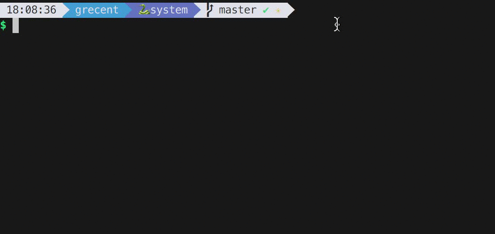

### grecent

The interactive branch switcher. It sorts your local branches by local commit and gives you an interactive interface to switch between them.

### Install 

Just run `npm i grecent -g` and start using `grecent` from any git repository :)
